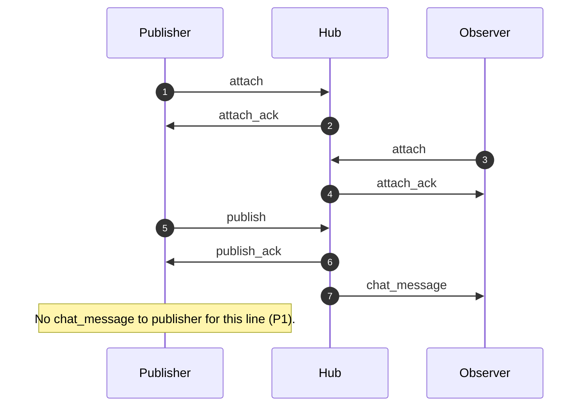

# ADR 0003: Wire protocol and compatibility

## Status

Proposed

## Context

The chat plane is **relayed through a daemon** (hub); clients connect over **QUIC** with **custom application framing**. [ADR 0002](0002-hexagonal-boundaries-and-ownership.md) keeps transport concerns in adapters; **this ADR** defines the **normative client ↔ daemon application protocol**: framing, JSON payloads, versioning, ordering, and compatibility rules.

Background from the spike (non-normative history): tickets and messages were JSON-oriented with **no wire versioning**; see [spike code review](../reference/spike-code-review.md) and [GUYOS_CORE_SPIKE_REFACTOR_TASKS.md](../../GUYOS_CORE_SPIKE_REFACTOR_TASKS.md). Until this ADR is accepted, those references remain **working assumptions**.

## Decision

### Normative scope

- **In scope:** **Client ↔ daemon (hub)** application messages and **compatibility policy**. **Hub behavior** that is visible on the wire (fan-out, ordering, deduplication) is specified here **where it affects** interoperability.
- **Out of scope (normative v1):** TLS identity, certificate pinning, authorization policies, and threat modeling (**Sec1**). Deployment binds trust and access control.
- **Implementation freedom:** How the daemon stores sessions, trims history, and schedules I/O—as long as wire obligations below are met.

### Sessions and routing

- **Room key:** The daemon maps each accepted connection to **exactly one** stable **room identifier**: the **canonical topic / room id** derived when the hub **decodes** the join ticket (**T1**). Fan-out is keyed **only** by this id; **multiple connections** (same user, multiple devices, reconnects) attach **multiple QUIC connections** to the **same** room key when their tickets decode to the **same** id.
- **Resume:** A new connection that presents the **same** ticket **or** another ticket that decodes to the **same** room id joins the **same** logical room. **History** and **replay** after attach are **daemon policy** (what the hub sends after attach or on demand)—they do **not** change the fan-out key.

### Protocol versioning (V1, H2)

- **Integers:** Each connection negotiates `**protocol_major`** and `**protocol_minor`** once, on **join / attach** (**H2**). Both sides **inherit** that pair for **all** subsequent **application** frames on that connection until disconnect.
- **Rules:**
  - **Unknown `protocol_major`** from the client → **reject** attach with `**error.code` = `protocol_major_unsupported`** (see **Appendix A**).
  - `**protocol_minor`:** **Additive** evolution only within the **same `protocol_major`**; receivers **MUST** ignore unknown JSON object keys (**P1**). **Breaking** changes require a `**protocol_major`** bump.
- **Ticket payload:** There is **no** separate **ticket-format version** field (**TV2**). **Ticket** layout evolves **with** the **wire protocol** version this ADR ties to the same release expectations.

### Serialization and framing (S1, F1)

- **Payload encoding:** **UTF-8 JSON** (**S1**) for all normative **v1** application bodies.
- **Framing:** `**u32` big-endian** byte length prefix, followed by **exactly** that many bytes of **UTF-8** JSON (**F1**). **One** bidirectional stream **may** carry many frames; **decoders** **MUST** enforce a **maximum frame size** (see **Limits**).
- **Non-normative:** Future **bulk** or **binary** data (e.g. file transfer) may use **additional** stream types, **different** framing, or `**protocol_major`** bumps; **S1** does **not** forbid **non-JSON** elsewhere when specified.

### Attach (join / negotiation)

- **Purpose:** Deliver `**protocol_major`**, `**protocol_minor`**, and the **opaque ticket string** (**J1**). The **hub** decodes the ticket and derives the **room key**; clients **MUST NOT** send decoded topic fields in place of the ticket for normative v1 attach.
- **Version negotiation:** Occurs **only** here (**H2**).
- **Cold start:** The **first** client→hub application frame **SHOULD** be `**attach`**; otherwise `**attach_required`** applies (see **Appendix A**).
- **Retry after failed attach:** After `**error`** in response to `**attach`**, the client **MAY** send `**attach`** again on the **same** application stream until `**attach_ack`** or the connection closes.

### Attach acknowledgement

- `**attach_ack`** is the **first successful** server→client application reply **after** an `**attach`** that the hub **accepts** — i.e. not necessarily after the **first** `**attach`** on that connection if earlier attempts failed with `**error`**.
- **Minimal normative content (A1):** Confirm success, echo the **canonical room id** string the hub uses for routing, and report **limits** relevant to this connection (see **Limits**).
- **Non-normative:** Implementations **may** piggyback **history** or **cursor** data in the same JSON object or in **follow-up** frames; that is **not** required for interoperability of **fan-out** and **publish**.

### Ordering (O1)

- The hub assigns a **monotonic per-room** `**seq`** (**u64** semantics). **Every** fan-out delivery of a **published** message **includes** the authoritative `**seq`** for that message in that room.
- **Total order:** All subscribers attached to the room **observe** the **same** `**seq`** ordering for **accepted** publishes.

### Publish, deduplication, identity (D2, M1, R3, F1)

- **Client-originated publish** **MUST** include a `**client_message_id`**: **UUID** string in **RFC 9562 / 4122 canonical** form (**lowercase** hex with hyphens) (**F1**, **M1**).
- `**text` UTF-8 payload** **may** be the **empty string** (**E-allow**).
- **Dedup scope:** **Same room** (same **room key**).
- **Idempotent retry (R3):** If a publish uses a `**client_message_id`** **already accepted** in that room, the hub **MUST NOT** fan out a **second** copy. The **publisher** **MUST** receive a **successful** acknowledgement carrying the **same** `**seq`** as the **first** acceptance.

### Publisher vs observers (**P1**)

- The **publishing** connection **only** receives `**publish_ack`** for its **accepted** publishes (`**client_message_id` + `seq`**).
- **Every other** connection in the room receives `**chat_message`** fan-out for that line.
- The hub **MUST NOT** send `**chat_message`** **back to the publisher** for the **same** logical message (**no** hub echo of own line).

### Illustrative sequence (non-normative)

The figure below is **illustrative** only; **Appendix A** and the Decision bullets remain **normative**.

Each arrow corresponds to **application** JSON objects sent as **F1** frames (u32 big-endian length prefix, UTF-8 JSON body **S1**) on the QUIC bidirectional stream; see **Serialization and framing (S1, F1)**.

### `seq` in JSON (N2)

- `**seq`** **MUST** appear as a **decimal string** encoding a **u64** (e.g. `"0"`, `"18446744073709551615"`) so values stay **lossless** in JSON tooling (**N2**).

### Message typing (T1)

- **Every** JSON application object **MUST** include a top-level `**type`** string (**flat `snake_case`** values — **K1**). **Routers** dispatch on `**type`** before interpreting other keys.
- **Normative v1 `type` values and required keys** are listed in **Appendix A**.

### Errors (E1)

- Failure payloads **MUST** use **an `error`** object with:
  - `**code`:** stable machine-readable string (library and UI mapping).
  - `**message`:** human-oriented description (debugging; not a contract for parsing).
  - `**details`:** optional JSON object for structured extras.
- **Closed v1 `error.code` values** are listed in **Appendix A**. Senders **MAY** introduce **new** codes in `**minor`** revisions only if receivers treat **unknown** `**code`** values as **generic failures** (**recommended**).

### Forward compatibility (P1)

- On **decode**, implementations **MUST** ignore **unknown** object keys for **every** normative message shape, **including** attach and errors. **Unknown `type`** values **SHOULD** be treated as an **error** or **logged** per policy (**major** bumps introduce new `**type`** values deliberately).

### Limits (normative v1)

- `**max_message_bytes`:** **65_536** — upper bound on **UTF-8 byte length** of `**text`** on `**publish`** (and `**chat_message**`).
- `**max_frame_bytes`:** **1_048_576** — upper bound on **payload byte length** **after** the `**u32`** length prefix (the JSON body). **MUST** be **≥** the largest legal framed message (including `**publish`** / `**chat_message`** envelopes under `**max_message_bytes**`).
- `**attach_ack**` **MUST** echo `**max_message_bytes`** and `**max_frame_bytes`** so clients need not hard-code limits.

## Consequences

- **Clients and hub** can be implemented **independently** against **JSON schemata + framing rules**; **Swift** and **CLI** can share the **same** contract.
- **Rolling upgrades** follow `**protocol_minor`** **additive** rules and **P1**; **breaking** changes are explicit `**protocol_major`** bumps **including** ticket layout (**TV2**).
- **Testing** can fix **golden frames**: **length prefix + JSON** **per `type`**.
- **Security** (who may reach the hub, TLS trust) remains **outside** this ADR’s **normative** text—operators must **compose** deployment controls.

## Open points

- **Future `minor` revisions:** Optional keys (e.g. `**sender_endpoint_id`**) and new `**error.code`** values—receivers remain **P1**-tolerant.
- **Future `major` revisions:** New `**type`** values, non-JSON payloads, or ticket layout changes (**TV2**).

---

## Appendix A — Normative v1 message shapes

**Conventions:** Top-level keys **snake_case**. `**type`** uses **flat `snake_case`** (**K1**). `**type`** is **required** on every message.

### v1 `type` summary

| `type`         | Direction                            | Purpose                                                                                                                                                                                                                |
| -------------- | ------------------------------------ | ---------------------------------------------------------------------------------------------------------------------------------------------------------------------------------------------------------------------- |
| `attach`       | C→S                                  | Join: `**protocol_major`**, `**protocol_minor`**, opaque `**ticket**`. Cold start: should be the first C→S frame; after `**error**` on `**attach**`, **may** retry `**attach`** on the **same** stream (**Decision**). |
| `attach_ack`   | S→C                                  | Success after `**attach`**: `**room_id`** echo, limits, `**server_protocol_minor**`.                                                                                                                                   |
| `publish`      | C→S                                  | Chat line + `**client_message_id**` + `**text**`. **Only** after successful `**attach`** (`**attach_ack`** received).                                                                                                  |
| `publish_ack`  | S→C                                  | `**seq**` assignment + `**client_message_id**` echo to the **publisher** (**R3**).                                                                                                                                     |
| `chat_message` | S→C                                  | Fan-out to **non-publisher** connections (**P1**).                                                                                                                                                                     |
| `error`        | S→C (and **may** C→S if ever needed) | `**error`** object per **E1**.                                                                                                                                                                                         |

### Required keys per `type`

- `**attach`:** `type`, `protocol_major` (integer), `protocol_minor` (integer), `ticket` (string, opaque to client).
- `**attach_ack`:** `type`, `room_id` (string, canonical room/topic id used for routing), `max_frame_bytes` (integer, **1_048_576** in v1), `max_message_bytes` (integer, **65_536** in v1), `server_protocol_minor` (integer, **required** — effective negotiated maximum `**protocol_minor`** for this connection).
- `**publish`:** `type`, `client_message_id` (canonical UUID string), `text` (string, UTF-8; **empty allowed**).
- `**publish_ack`:** `type`, `client_message_id`, `seq` (decimal string, **N2**).
- `**chat_message`:** `type`, `seq` (decimal string), `client_message_id`, `text` (string, UTF-8). **Optional:** `sender_endpoint_id` (string, when the hub can attribute the source connection — **S2**).
- `**error`:** `type`, `error` → `{ code, message, details? }` (**E1**).

### Closed v1 `error.code` values

| `error.code`                 | When                                                                                                             |
| ---------------------------- | ---------------------------------------------------------------------------------------------------------------- |
| `protocol_major_unsupported` | Client `**attach`** `**protocol_major`** is not supported by the hub.                                            |
| `ticket_decode_failed`       | Opaque `**ticket**` could not be **decoded** (encoding, UTF-8, parse) — **T1** syntax layer.                     |
| `invalid_ticket`             | Ticket **decoded** but **rejected** semantically (wrong shape, unknown room, etc.) — **T1**.                     |
| `frame_too_large`            | Declared frame length **>** `**max_frame_bytes`** (length-prefix / framing layer).                               |
| `message_too_large`          | `**text`** UTF-8 byte length **>** `**max_message_bytes`** on `**publish`**.                                     |
| `malformed_json`             | Bytes are not valid **UTF-8 JSON object** for this protocol.                                                     |
| `unknown_message_type`       | JSON parses but `**type`** is **missing** or not a **known v1** `**type`**.                                      |
| `attach_required`            | `**publish`** (or other C→S message) **before** successful `**attach`**, or first C→S frame is not `**attach`**. |
| `invalid_client_message_id`  | `**publish**` `**client_message_id**` is not a **canonical UUID** (**F1**).                                      |

**Recommendations for operators:** Use `**error.message`** / `**details`** for debugging only; `**code**` is the **stable** contract.